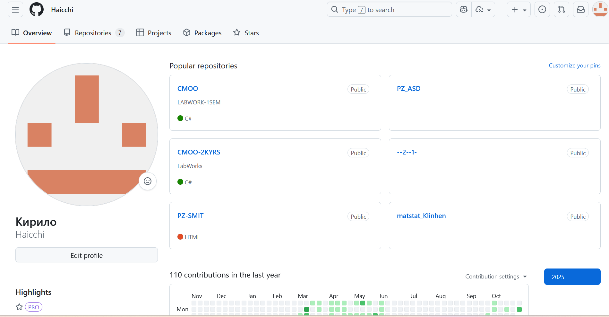
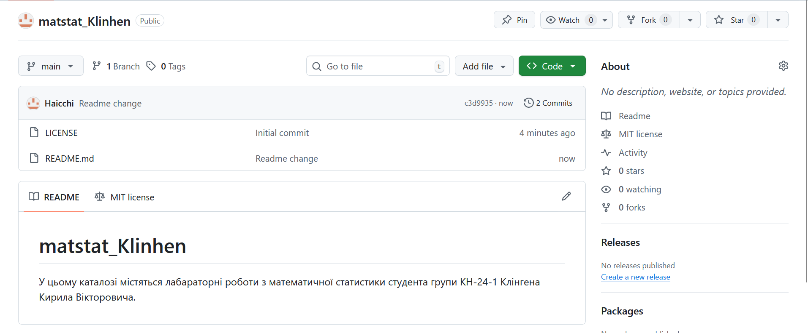
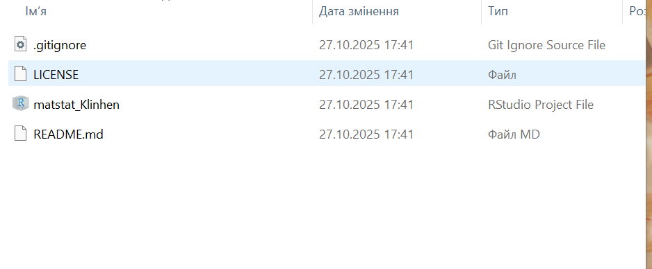

# Zvit-Lab-1

## Лабораторна робота №1 . Основи роботи з Git. Налаштування Git-GitHub середовища

## Author - Kyrylo Klingen

## Мета : швидкий старт для роботи із системою контроля версій (СКВ) Git та віддаленим репозиторієм GitHub.

## 1 . Створити аккаунт на GitHub і налаштувати доступ до нього (за SSH, або https протоколом).

## 2 . Створити на GitHub репозиторій matstat\_<student secondname> з файлом README такого вмісту: «У цьому каталозі містяться лабораторні роботи з математичної статистики студента групи <шифр групи> <ПІП>».

## 3 . Клонувати віддалений репозиторій на свій робочий комп’ютер.

## 4 . Контрольні питання.

- Що таке система контроля версій (СКВ) і для чого вона призначена? У
  чому принципова відмінність СКВ SVN та GIT? - СКВ це інструмент за
  допомогою якого можно одночасно працювати над одним проектом декільком
  людям або цілій команді , при цьому не заважаючи одне одному.Головною
  відміннюстю є те , що SVN - централізована система , а GIT -
  децентралізована система в якій дані зберігаються на кожному
  комп’ютері користувачів , а в SVN тільки на сервері.

- Що відбувається під час виконання команди git add? - Він додає зміни з
  робочого каталогу які будуть внесені після наступного коміту.

- Що відбувається під час виконання команди git commit? - Збереження
  змін в репозиторії.

- Якою Git-командою виконується розміщення локальної копії Git-
  репозиторію проєкта на віддаленому, що знаходиться на GitHub? - git
  clone

## 5 . Висновок

На цьому лабораторному занятті ми базово пройшлися по основким командам
для роботи із системою контроля версій (СКВ) Git та віддаленим
репозиторієм GitHub та налаштували роботу з R studio.
